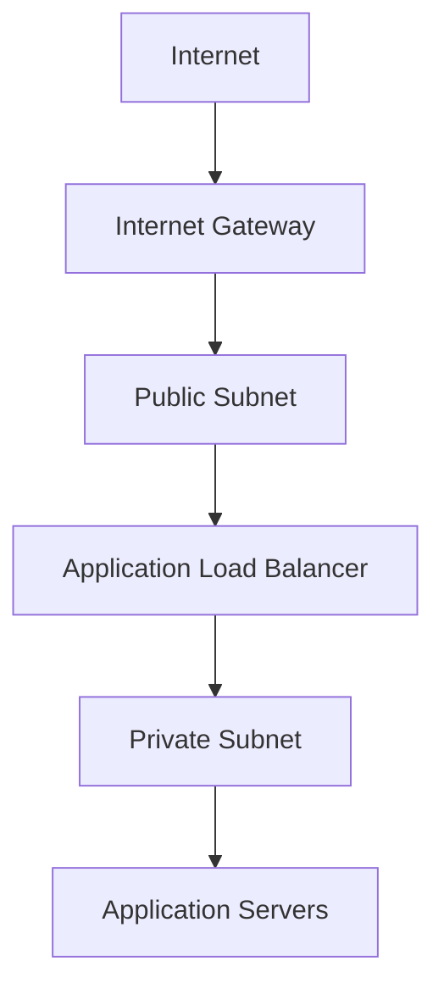
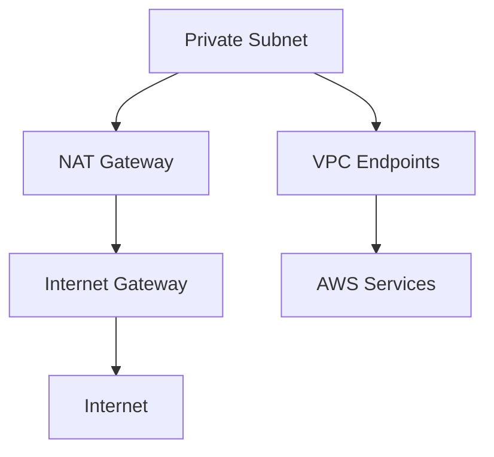
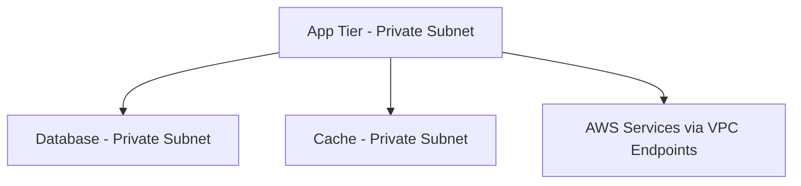

# 🏗️ AWS VPC Architecture Documentation

This document provides a detailed overview of the AWS VPC infrastructure created by this Terraform project.

## 📋 Table of Contents
- [Architecture Overview](#architecture-overview)
- [Network Design](#network-design)
- [Component Details](#component-details)
- [Traffic Flow](#traffic-flow)
- [Security Architecture](#security-architecture)
- [High Availability Design](#high-availability-design)
- [VPC Endpoints Strategy](#vpc-endpoints-strategy)

## 🏛️ Architecture Overview

This infrastructure creates a production-ready, multi-tier AWS VPC designed for hosting modern applications with strict security and availability requirements.

### Design Principles
- **Security by Design**: Default-deny approach with minimal required access
- **High Availability**: Multi-AZ deployment across 3 availability zones
- **Cost Optimization**: Gateway endpoints where possible, single NAT Gateway
- **Scalability**: Designed to support future growth and additional services
- **Compliance Ready**: Network isolation suitable for regulated workloads

## 🌐 Network Design

### IP Address Allocation

```
VPC CIDR: 10.0.0.0/16 (65,536 total IP addresses)
├── Public Subnets (768 IPs total)
│   ├── 10.0.1.0/24 (us-east-1a) - 254 usable IPs
│   ├── 10.0.2.0/24 (us-east-1b) - 254 usable IPs  
│   └── 10.0.3.0/24 (us-east-1c) - 254 usable IPs
└── Private Subnets (768 IPs total)
    ├── 10.0.4.0/24 (us-east-1a) - 254 usable IPs
    ├── 10.0.5.0/24 (us-east-1b) - 254 usable IPs
    └── 10.0.6.0/24 (us-east-1c) - 254 usable IPs

Reserved for future use: 10.0.7.0/24 through 10.0.255.0/24
```

### Subnet Strategy
- **Public Subnets**: Internet-facing resources (ALB, NAT Gateway, Bastion hosts)
- **Private Subnets**: Application tier (ECS, EC2, RDS, ElastiCache)
- **Future Expansion**: Additional subnets can be carved from remaining CIDR space

## 🔧 Component Details

### 1. Virtual Private Cloud (VPC)
```hcl
Resource: aws_vpc.production_vpc
CIDR: 10.0.0.0/16
DNS Support: Enabled
DNS Hostnames: Enabled
Instance Tenancy: Default
```

**Purpose**: Provides isolated network environment for all AWS resources.

### 2. Public Subnets (3x)
```hcl
Resources: aws_subnet.public_subnet_[1-3]
Auto-assign Public IP: Enabled
Internet Access: Direct via Internet Gateway
```

**Purpose**: 
- Application Load Balancers (ALB)
- NAT Gateway for private subnet internet access
- Bastion hosts for administrative access
- Public-facing web servers (if needed)

### 3. Private Subnets (3x)
```hcl
Resources: aws_subnet.private_subnet_[1-3]
Auto-assign Public IP: Disabled
Internet Access: Via NAT Gateway
```

**Purpose**:
- Application servers (ECS Fargate, EC2)
- Databases (RDS, ElastiCache)
- Internal microservices
- Batch processing workloads

### 4. Internet Gateway
```hcl
Resource: aws_internet_gateway.igw
Attached to: production_vpc
```

**Purpose**: Provides bidirectional internet connectivity for public subnets.

### 5. NAT Gateway
```hcl
Resource: aws_nat_gateway.nat_gateway
Location: public_subnet_3 (us-east-1c)
Elastic IP: aws_eip.nat_gateway_eip
```

**Design Decision**: Single NAT Gateway for cost optimization. For production workloads requiring higher availability, consider deploying NAT Gateways in multiple AZs.

**Purpose**: Enables outbound internet connectivity for private subnets while maintaining inbound security.

### 6. Route Tables

#### Public Route Table
```hcl
Resource: aws_route_table.public
Routes:
  - 0.0.0.0/0 → Internet Gateway
  - 10.0.0.0/16 → Local
Associated Subnets: All public subnets
```

#### Private Route Table  
```hcl
Resource: aws_route_table.private
Routes:
  - 0.0.0.0/0 → NAT Gateway
  - 10.0.0.0/16 → Local
Associated Subnets: All private subnets
```

## 🚦 Traffic Flow

### Inbound Traffic Flow


### Outbound Traffic Flow (Private Subnets)


### Internal Service Communication


## 🛡️ Security Architecture

### Network Access Control
- **Public Subnets**: Direct internet access, suitable for load balancers and bastion hosts
- **Private Subnets**: No direct internet access, protected by NAT Gateway
- **VPC Endpoints**: Private connectivity to AWS services without internet routing

### Security Groups Strategy

#### VPC Endpoints Security Group
```hcl
Resource: aws_security_group.vpc_endpoints
Ingress: 
  - Port 443 (HTTPS) from VPC CIDR (10.0.0.0/16)
Egress:
  - All traffic to 0.0.0.0/0
```

**Purpose**: Controls access to VPC endpoints, ensuring only VPC resources can access AWS services through PrivateLink.

### Defense in Depth
1. **Network Level**: Private subnets with no direct internet access
2. **Application Level**: Security groups acting as instance-level firewalls  
3. **Service Level**: VPC endpoints for secure AWS service access
4. **Data Level**: Encryption in transit via HTTPS/TLS

## 🔄 High Availability Design

### Multi-AZ Distribution
```
us-east-1a: Public Subnet 1 + Private Subnet 1
us-east-1b: Public Subnet 2 + Private Subnet 2  
us-east-1c: Public Subnet 3 + Private Subnet 3 + NAT Gateway
```

### Availability Considerations
- **Compute**: Deploy across multiple AZs for redundancy
- **Database**: RDS Multi-AZ deployments recommended
- **Load Balancing**: ALB can distribute across all public subnets
- **NAT Gateway**: Single point of failure - consider multiple NAT Gateways for critical workloads

### Fault Tolerance
- **AZ Failure**: Applications in other AZs continue operating
- **NAT Gateway Failure**: Private subnets lose internet access until manual intervention
- **Route Table**: Separate public/private routing for isolation

## 🔗 VPC Endpoints Strategy

### Interface Endpoints (AWS PrivateLink)
Deployed in all private subnets for high availability:

#### ECR API Endpoint
```hcl
Resource: aws_vpc_endpoint.ecr_api
Service: com.amazonaws.us-east-1.ecr.api
Purpose: ECR authentication and repository management
```

#### ECR DKR Endpoint
```hcl
Resource: aws_vpc_endpoint.ecr_dkr
Service: com.amazonaws.us-east-1.ecr.dkr
Purpose: Docker image registry operations
```

#### CloudWatch Logs Endpoint
```hcl
Resource: aws_vpc_endpoint.logs
Service: com.amazonaws.us-east-1.logs
Purpose: Application logging from private subnets
```

### Gateway Endpoints

#### S3 Gateway Endpoint
```hcl
Resource: aws_vpc_endpoint.s3
Service: com.amazonaws.us-east-1.s3
Type: Gateway
Route Tables: Private route table only
```

**Purpose**: 
- ECR layer storage access
- Application data storage
- No additional charges for data transfer

### Benefits of VPC Endpoints
- **Security**: Traffic never leaves AWS network
- **Performance**: Reduced latency vs internet routing
- **Cost**: Gateway endpoints have no hourly charges
- **Compliance**: Meets strict data sovereignty requirements

## 📊 Cost Analysis

### Monthly Cost Breakdown (us-east-1)
```
NAT Gateway:           $45.00  (includes 1GB data processing)
Elastic IP:            $3.60   (when not attached to instance)
Interface Endpoints:   $28.80  (4 endpoints × $7.20/month)
Gateway Endpoints:     $0.00   (S3 gateway endpoint)
Data Transfer:         Variable (based on usage)
-------------------------------------------------
Base Monthly Cost:     ~$77.40
```

### Cost Optimization Strategies
1. **Single NAT Gateway**: Reduces cost vs per-AZ deployment
2. **Gateway Endpoints**: Use for S3 instead of interface endpoints
3. **VPC Endpoint Monitoring**: Remove unused endpoints
4. **Data Transfer**: Monitor and optimize cross-AZ traffic

## 🔮 Future Enhancements

### Additional VPC Endpoints
Consider adding based on application needs:
- **RDS**: For managed database access
- **SSM**: For Systems Manager operations
- **Lambda**: For serverless function invocation
- **DynamoDB**: For NoSQL database access

### Security Enhancements
- **VPC Flow Logs**: Network traffic monitoring
- **AWS Config**: Configuration compliance monitoring
- **Network ACLs**: Additional subnet-level security
- **AWS WAF**: Web application firewall integration

### High Availability Improvements
- **Multi-NAT Gateway**: Deploy in each AZ for redundancy
- **Cross-Region**: VPC peering for disaster recovery
- **Transit Gateway**: For complex multi-VPC architectures

## 📖 Operational Considerations

### Monitoring
- CloudWatch metrics for NAT Gateway data transfer
- VPC Flow Logs for network analysis
- AWS Cost Explorer for cost monitoring

### Maintenance
- Regular security group audits
- Unused resource cleanup
- Security patch management for NAT instances (if used)

### Scaling
- Monitor IP address utilization
- Plan subnet expansion in advance
- Consider VPC peering for multi-VPC architectures

---

This architecture provides a solid foundation for modern cloud applications while maintaining security, availability, and cost-effectiveness. The modular design allows for easy expansion and customization based on specific application requirements.
