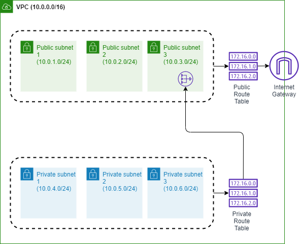

# AWS Production-Ready VPC Infrastructure with Terraform

This project creates a comprehensive, production-ready AWS Virtual Private Cloud (VPC) infrastructure using Terraform. It includes public and private subnets across multiple availability zones, internet connectivity, NAT gateways, and VPC endpoints for secure AWS service access from private subnets.

## 🏗️ What This Project Creates

This infrastructure is designed to support enterprise-grade applications with:

### Core Networking
- **VPC**: Isolated virtual network with DNS support enabled
- **Public Subnets**: 3 subnets across different AZs for load balancers, NAT gateways, and bastion hosts
- **Private Subnets**: 3 subnets across different AZs for application servers and databases
- **Internet Gateway**: Provides internet access for public subnets
- **NAT Gateway**: Enables outbound internet access for private subnets
- **Route Tables**: Proper routing configuration for public and private traffic

### VPC Endpoints (AWS PrivateLink)
Secure, private connectivity to AWS services without internet routing:
- **ECR API Endpoint**: For container registry authentication and metadata
- **ECR DKR Endpoint**: For Docker image pulls/pushes
- **S3 Gateway Endpoint**: For ECR layer storage and general S3 access
- **CloudWatch Logs Endpoint**: For application logging from private subnets

### Security
- **VPC Endpoints Security Group**: Controls access to VPC endpoints with HTTPS (443) ingress from VPC CIDR

## 🎯 Use Cases

I use this network foundation in my other projects:
- **[ECS Fargate Clusters](https://github.com/chris-piwinsky/ecs_project)**: Running containerized applications
- **[Aurora PostgreSQL](https://github.com/chris-piwinsky/rds_work)**: Database deployments in private subnets
- **Web Applications**: Multi-tier applications with proper network isolation
- **Microservices**: Service-to-service communication within private networks

## 📐 Architecture Overview



📖 **For detailed architecture information, see [ARCHITECTURE.md](./ARCHITECTURE.md)**

## 🔧 Infrastructure Configuration

### Network Configuration
- **VPC CIDR**: `10.0.0.0/16` (65,536 IP addresses)
- **Public Subnets**: 
  - `10.0.1.0/24` (us-east-1a)
  - `10.0.2.0/24` (us-east-1b) 
  - `10.0.3.0/24` (us-east-1c)
- **Private Subnets**:
  - `10.0.4.0/24` (us-east-1a)
  - `10.0.5.0/24` (us-east-1b)
  - `10.0.6.0/24` (us-east-1c)

### High Availability
- **Multi-AZ Design**: Resources distributed across 3 availability zones
- **Fault Tolerance**: NAT Gateway with Elastic IP for consistent outbound connectivity
- **Scalability**: Each subnet provides 254 usable IP addresses

## 📋 Prerequisites

Before deploying this infrastructure:

- **[Terraform](https://developer.hashicorp.com/terraform/tutorials/aws-get-started/install-cli)** v1.0+ installed on your local machine
- **AWS Account** with appropriate permissions
- **AWS CLI** configured or access keys with permissions for:
  - VPC, Subnet, and Route Table management
  - Internet Gateway and NAT Gateway creation
  - VPC Endpoints and Security Groups
  - Elastic IP allocation
- **Terraform Backend** (optional): Consider using S3 + DynamoDB for state management in production

## 🚀 Quick Start

### 1. Clone and Setup
```bash
git clone <repository-url>
cd aws_networking
```

### 2. Configure Variables
Create a `terraform.tfvars` file:
```hcl
AWS_ACCESS_KEY = "your-access-key"
AWS_SECRET_KEY = "your-secret-key" 
REGION         = "us-east-1"
```

### 3. Deploy Infrastructure
```bash
# Initialize Terraform
terraform init

# Preview changes
terraform plan

# Deploy infrastructure  
terraform apply

# When finished, cleanup
terraform destroy
```

## 💰 Cost Considerations

### Estimated Monthly Costs (us-east-1)
- **NAT Gateway**: ~$45/month (includes data processing charges)
- **Elastic IP**: ~$3.60/month (when not attached to running instance)
- **VPC Endpoints**: ~$7.20/month per interface endpoint (4 endpoints = ~$28.80)
- **Data Transfer**: Variable based on usage

**Total Base Cost**: ~$77-80/month (excluding data transfer)

### Cost Optimization Tips
- Consider NAT Instances instead of NAT Gateway for development environments
- Use VPC Gateway Endpoints (S3) instead of Interface Endpoints where possible
- Monitor VPC Endpoint usage and remove unused endpoints

## 📤 Terraform Outputs

This module provides the following outputs for use in other Terraform configurations:

### Core Infrastructure
| Name                               | Description                           | Type   |
| ---------------------------------- | ------------------------------------- | ------ |
| vpc_id                             | VPC ID                                | string |
| vpc_cidr_block                     | CIDR block of VPC                     | string |
| public_subnet_1_id                 | Public subnet 1 ID (us-east-1a)      | string |
| public_subnet_2_id                 | Public subnet 2 ID (us-east-1b)      | string |
| public_subnet_3_id                 | Public subnet 3 ID (us-east-1c)      | string |
| private_subnet_1_id                | Private subnet 1 ID (us-east-1a)     | string |
| private_subnet_2_id                | Private subnet 2 ID (us-east-1b)     | string |
| private_subnet_3_id                | Private subnet 3 ID (us-east-1c)     | string |

### Gateways & Routing  
| Name                               | Description                           | Type   |
| ---------------------------------- | ------------------------------------- | ------ |
| internet_gateway_id                | ID of the Internet Gateway            | string |
| nat_gateway_id                     | ID of the NAT Gateway                 | string |
| nat_gateway_eip                    | Elastic IP address of the NAT Gateway | string |
| public_route_table_id              | ID of the public route table          | string |
| private_route_table_id             | ID of the private route table         | string |

### VPC Endpoints & Security
| Name                               | Description                           | Type   |
| ---------------------------------- | ------------------------------------- | ------ |
| vpc_endpoints_security_group_id    | Security Group ID for VPC endpoints   | string |
| ecr_api_vpc_endpoint_id            | ID of the ECR API VPC endpoint        | string |
| ecr_dkr_vpc_endpoint_id            | ID of the ECR DKR VPC endpoint        | string |
| s3_vpc_endpoint_id                 | ID of the S3 VPC endpoint             | string |
| logs_vpc_endpoint_id               | ID of the CloudWatch Logs VPC endpoint| string |
| ecr_api_vpc_endpoint_dns_names     | DNS names of the ECR API VPC endpoint | list   |
| ecr_dkr_vpc_endpoint_dns_names     | DNS names of the ECR DKR VPC endpoint | list   |
| logs_vpc_endpoint_dns_names        | DNS names of the CloudWatch Logs VPC endpoint| list   |

## 🔄 Using as a Module

You can use this as a Terraform module in other projects:

```hcl
module "networking" {
  source = "git::https://github.com/your-username/aws_networking.git"
  
  # Required variables
  vpc_cidr              = "10.0.0.0/16"
  public_subnet_1_cidr  = "10.0.1.0/24"
  public_subnet_2_cidr  = "10.0.2.0/24" 
  public_subnet_3_cidr  = "10.0.3.0/24"
  private_subnet_1_cidr = "10.0.4.0/24"
  private_subnet_2_cidr = "10.0.5.0/24"
  private_subnet_3_cidr = "10.0.6.0/24"
  region                = "us-east-1"
}

# Use outputs in your resources
resource "aws_instance" "app_server" {
  subnet_id = module.networking.private_subnet_1_id
  # ... other configuration
}
```

## 🔧 Advanced Configuration

### Customizing CIDR Blocks
You can modify the network configuration by updating the variables in `main.tf`:

```hcl
module "networking" {
  source = "./networking"
  
  # Custom VPC CIDR
  vpc_cidr = "172.16.0.0/16"  # Alternative private range
  
  # Custom subnet CIDRs
  public_subnet_1_cidr  = "172.16.1.0/24"
  public_subnet_2_cidr  = "172.16.2.0/24"
  public_subnet_3_cidr  = "172.16.3.0/24"
  private_subnet_1_cidr = "172.16.10.0/24"
  private_subnet_2_cidr = "172.16.11.0/24"  
  private_subnet_3_cidr = "172.16.12.0/24"
  
  region = "us-west-2"  # Different region
}
```

### Adding Additional VPC Endpoints
To add more VPC endpoints (e.g., for RDS, SSM), modify `networking/vpc_endpoints.tf`:

```hcl
# Example: RDS VPC Endpoint
resource "aws_vpc_endpoint" "rds" {
  vpc_id              = local.vpc_id
  service_name        = "com.amazonaws.${var.region}.rds"
  vpc_endpoint_type   = "Interface"
  subnet_ids          = local.vpc_endpoint_subnet_ids
  security_group_ids  = [aws_security_group.vpc_endpoints.id]
  private_dns_enabled = true
  
  tags = {
    Name = "project-rds"
  }
}
```

## 📊 Monitoring and Troubleshooting

### VPC Flow Logs (Optional Enhancement)
Consider adding VPC Flow Logs for network monitoring:

```hcl
resource "aws_flow_log" "vpc_flow_log" {
  iam_role_arn    = aws_iam_role.flow_log.arn
  log_destination = aws_cloudwatch_log_group.vpc_flow_log.arn
  traffic_type    = "ALL"
  vpc_id          = aws_vpc.production_vpc.id
}
```

### Testing Connectivity
After deployment, test connectivity:

```bash
# Test internet connectivity from public subnet
# (requires EC2 instance in public subnet)
curl -I http://httpbin.org/ip

# Test VPC endpoint connectivity from private subnet
# (requires EC2 instance in private subnet)
aws ecr get-login-token --region us-east-1
```

## 🛡️ Security Best Practices

This infrastructure implements several security best practices:

- ✅ **Network Isolation**: Private subnets have no direct internet access
- ✅ **VPC Endpoints**: AWS service access without internet routing
- ✅ **Security Groups**: Principle of least privilege for VPC endpoints
- ✅ **DNS Resolution**: Private DNS enabled for VPC endpoints
- ✅ **Multi-AZ**: High availability across availability zones

### Additional Security Recommendations
- Enable VPC Flow Logs for network monitoring
- Implement NACLs for additional subnet-level security
- Use AWS PrivateLink for all supported AWS services
- Regular security group audits and unused resource cleanup
- Consider AWS Config for compliance monitoring

## 🚀 Infrastructure Setup

### Basic Deployment

- Clone the repository to your local machine
- Navigate to the project directory
- Create a `terraform.tfvars` file with your AWS credentials and region
- Run `terraform init` to download the necessary provider plugins
- Run `terraform plan` to preview the changes that Terraform will make
- Run `terraform apply` to create the infrastructure on AWS
- When finished, run `terraform destroy` to delete all resources

### Production Deployment
For production environments, consider:

1. **Remote State Management**:
```hcl
terraform {
  backend "s3" {
    bucket         = "your-terraform-state-bucket"
    key            = "networking/terraform.tfstate"
    region         = "us-east-1"
    dynamodb_table = "terraform-state-lock"
    encrypt        = true
  }
}
```

2. **Environment-Specific Variables**:
```bash
# Development
terraform apply -var-file="environments/dev.tfvars"

# Staging  
terraform apply -var-file="environments/staging.tfvars"

# Production
terraform apply -var-file="environments/prod.tfvars"
```

## 📚 Additional Resources

### AWS Documentation
- [VPC User Guide](https://docs.aws.amazon.com/vpc/latest/userguide/)
- [VPC Endpoints Guide](https://docs.aws.amazon.com/vpc/latest/privatelink/)
- [NAT Gateways](https://docs.aws.amazon.com/vpc/latest/userguide/vpc-nat-gateway.html)

### Terraform Documentation  
- [Terraform AWS Provider](https://registry.terraform.io/providers/hashicorp/aws/latest/docs)
- [Terraform Best Practices](https://developer.hashicorp.com/terraform/docs)

### Related Projects
- [AWS ECS with Fargate](https://github.com/chris-piwinsky/ecs_project)
- [Aurora PostgreSQL Setup](https://github.com/chris-piwinsky/rds_work)

## 🤝 Contributing

1. Fork the repository
2. Create a feature branch (`git checkout -b feature/amazing-feature`)
3. Commit your changes (`git commit -m 'Add some amazing feature'`)
4. Push to the branch (`git push origin feature/amazing-feature`)
5. Open a Pull Request

## 📄 License

This project is licensed under the MIT License - see the [LICENSE](LICENSE) file for details.
